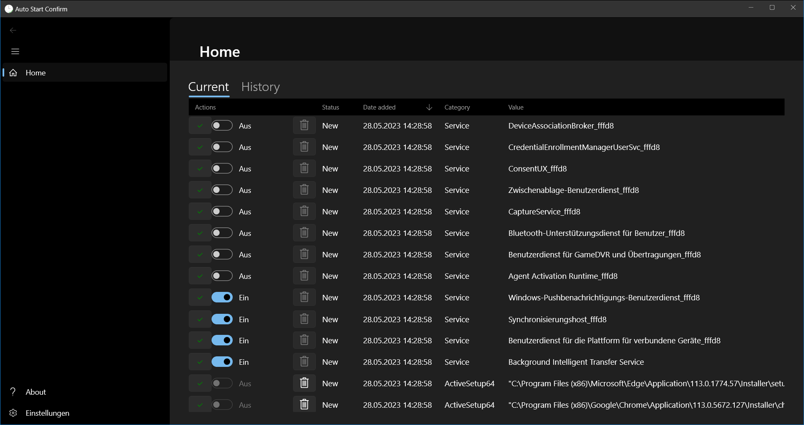
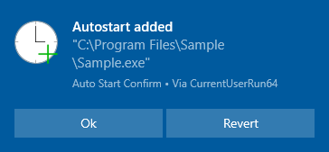
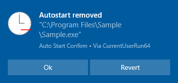

# Auto Start Confirm

[](https://github.com/ChristianGalla/AutoStartConfirm/releases/latest)
[](https://github.com/ChristianGalla/AutoStartConfirm/releases/latest)
[](https://github.com/ChristianGalla/AutoStartConfirm/blob/master/LICENSE)
[](https://github.com/ChristianGalla/AutoStartConfirm/releases/latest)
[](https://github.com/ChristianGalla/AutoStartConfirm/actions/workflows/ci.yml)

More and more programs want to start automatically when Windows starts, or a user logs on.

Many startup programs can slow down the boot process.
In addition, malicious software, such as keyloggers, can survive reboots.

Therefore, this program monitors whether a program wants to start automatically and asks the user for permission.

## Table of contents

* [Changelog](#changelog)
* [Installation](#installation)
  * [Windows Package Manager (Winget)](#windows-package-manager-winget)
* [Artifact attestation](#artifact-attestation)
* [Usage documentation](#usage-documentation)
* [Usage warning](#usage-warning)
* [State of development](#state-of-development)
* [Current limitations](#current-limitations)
* [Similar programs](#similar-programs)
* [How to build and debug](#how-to-build-and-debug)

## Changelog

You can find recent changes in the file [CHANGELOG.md](https://github.com/ChristianGalla/AutoStartConfirm/blob/master/CHANGELOG.md).
 

## Installation

The installers of the latest version can be downloaded from the [release page](https://github.com/ChristianGalla/AutoStartConfirm/releases/latest).

There are two versions:
1. AutoStartConfirmSetup_Standalone.msi
2. AutoStartConfirmSetup_FrameworkDependent.msi

Usually, you should download and install **AutoStartConfirmSetup_Standalone.msi**. This version includes all dependencies and can easily be installed on any computer.

The installer **AutoStartConfirmSetup_FrameworkDependent.msi** includes all dependencies except the **.NET Desktop Runtime** and is therefore much smaller.
If multiple programs are using the runtime, only one central runtime installation can save disk space and enable independent security updates.
When using this installer, you are responsible for installing the correct runtime version. If it is not installed, the program cannot run.

The .NET Desktop Runtime depends on the program version:

| Program version        | .NET Desktop Runtime | Microsoft's Runtime support end date |
|------------------------|------------------------------|-----------------------------|
| 4.X.Y (future release) | [10.0](https://dotnet.microsoft.com/download/dotnet/10.0) | 2028-11-10 |
| 3.X.Y                  | [8.0](https://dotnet.microsoft.com/download/dotnet/8.0) | 2026-11-10 |
| 2.X.Y                  | [7.0](https://dotnet.microsoft.com/download/dotnet/7.0) | 2024-05-14 |
| 1.X.Y                  | [4.7](https://dotnet.microsoft.com/download/dotnet-framework/net47)| - |


### Windows Package Manager (Winget)

This program is available via [winget](https://learn.microsoft.com/en-us/windows/package-manager/winget/).
You can install it using the following command prompt or PowerShell command:

```powershell
winget install ChristianGalla.AutoStartConfirm
```

## Artifact attestation

For all releases after January 2025 this project uses [artifact attestation](https://docs.github.com/en/actions/security-for-github-actions/using-artifact-attestations/using-artifact-attestations-to-establish-provenance-for-builds).

You can verify if your Auto Start Confirm installer, executable or dynamic link library file has been generated inside a release workflow of this repository by using the following command after installing the [GitHub CLI](https://github.com/cli/cli#installation):

```powershell
gh attestation verify --repo ChristianGalla/AutoStartConfirm AutoStartConfirmSetup_Standalone.msi
```

Also, you can verify the software bill of materials (SBOM):

```powershell
gh attestation verify --repo ChristianGalla/AutoStartConfirm --predicate-type https://spdx.dev/Document/v2.3 --format=json AutoStartConfirmSetup_Standalone.msi
```

## Usage documentation

The program starts in the background and can be accessed using its icon in the notification area
(usually in the bottom right corner of the taskbar).



All currently known auto starts are listed in the "Current" tab.
A history of added or removed auto starts can be accessed using the "Add history" and "Remove history" tabs.

For each auto start there is a "Confirm" and "Remove" button to easily mark checked auto starts and remove unwanted ones.

When a new auto start is added or removed, a toast notification appears:





A click on the "Ok" button confirms the change and a click on the "Revert" button undoes it.

When the program is started, it compares the current auto starts to the known ones when it last run.
Therefore, changes will be detected, even if the program is not running all time.

## Usage warning

Some useful programs require services to start automatically.
When their auto start is blocked, they may not function properly.
Also, for example a blocked update service may lead to insecure environments because of not patched security bugs in old program versions.

Therefore, auto starts should only be blocked if there is no negative impact on the affected programs.

## State of development

There are many locations Windows provides for programs to start automatically.
Currently only the following locations are monitored by Auto Start Confirm.

### Currently monitored

- [x] Boot execute
- [x] Appinit DLLs
- [x] Logon
- [x] Scheduled Tasks
- [x] Services and drivers

### Implementation currently not planned

- [ ] Winlogon
- [ ] Known DLLs
- [ ] Explorer Addons
- [ ] Image hijacks
- [ ] Winsock
- [ ] LSA security providers
- [ ] Print monitor DLLs
- [ ] Codecs
- [ ] Internet Explorer Addons
- [ ] Office Add-Ins
- [ ] WMI

For details see the parameters of the [Autoruns PowerShell Module](https://github.com/p0w3rsh3ll/AutoRuns).

## Current limitations

To be able to use as less privileges as needed, Auto Start Confirm currently runs in user mode and therefore can only monitor and react after changes occurred.
There are a few advantages of this implementation, for example even users that are not administrators are able to run the program.
Currently, it is not planned to change this implementation.

Currently, it is not planned to create a 32-bit version of the program because most Windows installations are already 64-bit and additional work is needed
for example, to access 64-bit registry keys from a 32-bit program.

## Similar programs

This program is similar to [Sysinternals Autoruns](https://docs.microsoft.com/en-us/sysinternals/downloads/autoruns).
Sysinternals Autoruns is a great tool for analyzing and disabling or enabling existing autostart programs.
However, it lacks the function to monitor auto start locations in background and ask users for permission when changes occurred.

Sysinternals Autoruns is not an Open Source program, but there is a [Autoruns PowerShell Module](https://github.com/p0w3rsh3ll/AutoRuns)
that was used as reference to determine where Auto Start Confirm should look for auto start locations.

## How to build and debug

This program was created in Visual Studio.

There are some NuGet dependencies that must be installed before it can be compiled.

To build the installers using the [WiX Toolset](https://wixtoolset.org/) execute [Build/Daily_Debug.bat](Build/Daily_Debug.bat) for a debug or [Build/Daily_Release.bat](Build/Daily_Release.bat) for a release version build.

To extract third party licenses run [Build/Export-ThirdPartyLicenses.ps1](Build/Export-ThirdPartyLicenses.ps1):

```powershell
.\Build\Export-ThirdPartyLicenses.ps1
```

This installs the `nuget-license` and `Pandoc` tools if needed, extracts the license information for `AutoStartConfirmLib`'s dependencies into `AutoStartConfirmLib\Licenses\Licenses.json` (read by the app's about page to render a table of package name, version, author, project url and downloaded license file), downloads the individual license texts and converts any HTML license file to plain text, since HTML should not be rendered inside the app for security reasons.
